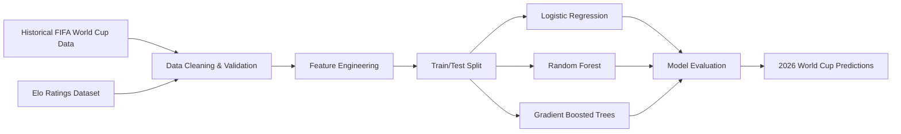

# ⚽ Predicting FIFA World Cup Advancement with Apache Spark Machine Learning

**DS 5110 – Data Engineering II: Big Data Systems**  
**University of Virginia | Summer 2026**

**Authors**

- Joseph Bannon (jb9war)
- Sarah Christen (sc8rg)
- Carlos Canales (csz3rb)

---

## Project Overview

The FIFA World Cup is one of the world's most widely followed sporting events, yet predicting tournament outcomes remains a difficult machine learning problem due to limited historical data and highly imbalanced outcome classes.

This project developed an end-to-end machine learning workflow using **Apache Spark MLlib** to predict how far national teams advance in the FIFA World Cup using only **pre-tournament information**.

Four binary classification tasks were modeled independently:

- Quarter-finalist
- Semi-finalist
- Finalist
- World Cup Champion

Historical tournament data were combined with **Elo ratings**, **FIFA rankings**, **team performance statistics**, **squad market values**, and **previous World Cup experience** to train predictive models. The final model was then applied to generate predictions for the **2026 FIFA World Cup**.

---

# 🏆 Highlights

| Model | Best Prediction Task | Best F1 Score | Best AUROC |
|:------|:---------------------|--------------:|-----------:|
| Logistic Regression | Quarter-finalist | 0.533 | 0.870 |
| Random Forest | Quarter-finalist | 0.588 | **0.906** |
| Gradient Boosted Trees | Quarter-finalist | **0.632** | 0.833 |

### Key Findings

- 🌳 **Gradient Boosted Trees** provided the strongest overall predictive performance and were selected as the final model.
- 🌲 **Random Forest** achieved the highest AUROC for quarter-final prediction.
- 📈 Tree-based methods consistently outperformed the Logistic Regression baseline.
- ⚽ Historical **Elo ratings, squad market value, FIFA rankings, recent team performance, and previous World Cup success** were the strongest predictors of advancement.
- 🏆 Predicting the tournament champion remained extremely difficult because only six historical champions were available for training.

---

# 📊 Project Workflow



---

# 📂 Repository Contents

```
.
├── data/
│   ├── Historical World Cup datasets
│   └── 2026 prediction dataset
│
├── notebooks/
│   └── FIFA_World_Cup_Prediction.ipynb
│
├── images/
│   └── EDA figures used in the report and presentation
│
├── presentation/
│   └── HTML slide presentation
│
├── report/
│   └── Final project paper
│
└── README.md
```

---

# 📁 Datasets

## Historical FIFA World Cup Dataset

Primary dataset containing one observation per national team for each World Cup from **2002–2022**.

Features include:

- Goals scored
- Goals conceded
- Wins, losses, and draws
- FIFA ranking
- FIFA points
- Squad average age
- Squad total market value
- Previous World Cup appearances
- Previous tournament advancement

Target variables:

- Quarter-finalist
- Semi-finalist
- Finalist
- Winner

---

## Elo Ratings Dataset

A second dataset containing historical Elo ratings was merged with the historical World Cup data.

Additional features include:

- Pre-tournament Elo rating
- Historical Elo summaries
- Team rating statistics

Historical Elo values were aligned to the **year immediately preceding each World Cup** to prevent information leakage.

---

# ⚙️ Data Preprocessing

The Apache Spark ML pipeline included:

- Schema-based data import
- Data quality validation
- Duplicate detection
- Missing value analysis
- Historical Elo joins
- Median imputation
- Missing-value indicator engineering
- Log transformation of squad market value
- Feature encoding
- Feature assembly

Missing values were retained through median imputation to maximize the number of historical training observations.

---

# 🔍 Exploratory Data Analysis

Several exploratory analyses were performed to understand the predictors before model development.

Major findings included:

- Elo ratings followed an approximately normal distribution.
- Squad market value was highly right-skewed and benefited from a logarithmic transformation.
- FIFA rankings and Elo ratings exhibited a strong inverse relationship.
- Teams reaching the quarter-finals generally entered tournaments with substantially higher Elo ratings.
- Historical team quality, recent performance, and previous World Cup success were all associated with deeper tournament advancement.

---

# 🤖 Machine Learning Models

Three supervised classification algorithms were evaluated using Spark MLlib.

## Logistic Regression

Baseline linear classifier used for comparison.

---

## Random Forest

Tree ensemble capable of capturing nonlinear interactions while providing interpretable feature importance.

---

## Gradient Boosted Trees

Sequential boosted tree ensemble that achieved the strongest overall predictive performance and was selected as the final model.

---

# 📈 Model Evaluation

A chronological train/test split was used.

| Dataset | Years |
|----------|-------|
| Training | 2002–2018 |
| Testing | 2022 |
| Prediction | 2026 |

The 2022 World Cup served as an independent held-out test set.

Evaluation metrics included:

- Accuracy
- Precision
- Recall
- F1 Score
- AUROC

Because the dataset is highly imbalanced, **F1 Score** and **AUROC** were emphasized when comparing models.

---

# 🌳 Feature Importance

The tree-based models consistently identified similar predictors of tournament success.

### Gradient Boosted Trees

Top predictors:

1. Wins (last 4 years)
2. Squad market value
3. FIFA points
4. Squad average age
5. Goals conceded
6. Maximum Elo rating
7. Goals scored
8. FIFA ranking
9. Previous group-stage success
10. Previous quarter-final appearances

### Random Forest

Top predictors:

- Maximum Elo rating
- Average Elo rating
- Previous group-stage advancement
- Squad market value
- Minimum Elo rating
- Historical Elo rating
- Squad age
- Previous World Cup experience

Overall, both tree-based models emphasized:

- Team quality
- Historical success
- Squad value
- Recent international performance

---

# 🌎 2026 FIFA World Cup Predictions

After model development, the selected Gradient Boosted Tree models were applied to the qualified teams for the 2026 FIFA World Cup.

Separate probability estimates were generated for:

- Quarter-final advancement
- Semi-final advancement
- Final appearance
- Tournament champion

The quarter-final, semi-final, and finalist models produced meaningful probability rankings across teams.

The champion model assigned nearly identical probabilities to every team due to the extremely limited number of historical World Cup winners available for training.

---

# 🚀 Technologies

- Apache Spark
- Spark MLlib
- Python
- Pandas
- NumPy
- Matplotlib
- Git
- GitHub
- Jupyter Notebook

---

# 🔮 Future Work

Potential improvements include:

- Player-level statistics
- Injury reports
- Expected goals (xG)
- Betting market odds
- Match-level historical features
- Additional international competitions
- XGBoost and LightGBM implementations
- Larger historical datasets as future World Cups become available

---

# 📄 Course Information

**DS 5110 – Data Engineering II: Big Data Systems**

University of Virginia

Summer 2026

---

# 📜 License

This repository was created for educational purposes as part of the University of Virginia DS 5110 course.
